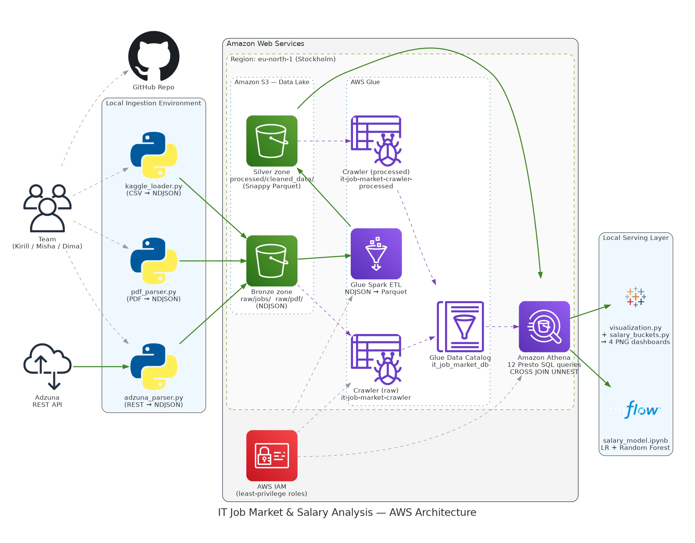

# IT Job Market & Salary Analysis

> A cloud-native, fully serverless Big Data pipeline on AWS — ingesting from **three independent
> sources** (REST API + CSV + PDF), cataloging through AWS Glue, querying with Amazon Athena, and
> predicting compensation with a scikit-learn salary-prediction model.


---

## Table of Contents

- [Overview](#overview)
- [Team](#team)
- [Architecture](#architecture)
- [Data Sources](#data-sources)
- [Key Findings](#key-findings)
- [Repository Structure](#repository-structure)
- [Technology Stack](#technology-stack)
- [Quick Start](#quick-start)
- [Documentation](#documentation)
- [Course Criteria Mapping](#course-criteria-mapping)
- [License](#license)

---

## Overview

The global IT job market shifts faster than any quarterly report can keep up with. This project
answers the question every developer, recruiter, and hiring manager actually cares about — **which
technologies are in demand right now, and which ones actually pay** — by building a real,
end-to-end Big Data analytics pipeline on AWS.

The pipeline ingests from **three distinct source formats** (live REST API, public CSV dataset,
and PDF industry reports), lands everything in Amazon S3 as NDJSON, lets an AWS Glue Spark job
materialize the data as Parquet in the silver zone, and runs serverless SQL analytics in Amazon
Athena. Finally, a scikit-learn Random Forest regressor predicts annual compensation from the
extracted feature set.

### Why this matters

Most "tech trend" reports rely on surveys. We rely on the actual hiring market — which is louder,
faster, and a lot more honest about what companies will pay for.

---

## Team

| Member                 | Role                             | Owned Layer                                                        |
| ---------------------- | -------------------------------- | ------------------------------------------------------------------ |
| **Kirill Staroshchuk** | Project Lead & Cloud Architect   | AWS infrastructure, IAM, coordination, documentation               |
| **Mykhailo Bitiukov**  | Data Acquisition Engineer        | Python scrapers (API + CSV + PDF), normalization, S3 upload        |
| **Dmytro Buran**       | Cloud Data Engineer & BI Analyst | Glue Crawler, Glue Spark ETL, Athena SQL, visualizations, ML model |

---

## Architecture

Fully serverless — no managed clusters, no idle compute, no EC2 to babysit. Three ingestion
scripts converge into one S3 bronze zone; from there a single Glue Spark job promotes the data
to columnar Parquet in the silver zone for fast analytics.



> **Note on the original plan:** the initial architecture used Amazon QuickSight as the BI
> front-end. The QuickSight registration looped repeatedly in `eu-north-1`, so we pivoted to a
> decoupled local BI layer driven by Athena CSV exports — no fidelity loss, full reproducibility
> from version control. See [`docs/ARCHITECTURE.md`](docs/ARCHITECTURE.md) for the full
> architectural rationale and trade-offs.

---

## Data Sources

The pipeline ingests from **three distinct source formats** — explicitly mapped to the course's
`Data Ingestion Layer` requirement of supporting _"flat files, JSON, columnar, streams, PDF, etc."_

| Source                      | Format  | Script                                              | Volume             | Closes requirement       |
| --------------------------- | ------- | --------------------------------------------------- | ------------------ | ------------------------ |
| **Adzuna REST API**         | NDJSON  | `src/1_ingestion/adzuna_parser.py`                  | 519 vacancies      | JSON files, REST stream  |
| **Kaggle Salaries Dataset** | CSV     | `src/1_ingestion/kaggle_loader.py`                  | ~3,700 records     | Flat files / CSV loading |
| **Industry PDF reports**    | PDF     | `src/1_ingestion/pdf_parser.py`                     | 2 reports, 6 pages | PDF parsing              |
| **Glue Spark ETL output**   | Parquet | `src/2_transformation/glue_spark_transformation.py` | 169 cleaned rows   | Columnar files           |

All three ingestion scripts produce **NDJSON in the same unified schema** so that the downstream
Glue Crawler / Athena layer treats them as one corpus.

---

## Key Findings

After joining the live Adzuna corpus to its salary observations (**519 raw vacancies, 169 with
a usable salary value** after currency normalisation and outlier trimming):

### Top 3 Most Demanded Skills

| Rank | Skill  | Mentions |
| ---- | ------ | -------- |
| 1    | SQL    | 57       |
| 2    | Python | 46       |
| 3    | Java   | 38       |

**Insight:** Cloud & DevOps competencies (CI/CD 33, Azure 29, AWS 26, Kubernetes 23) form a
strong second tier — they are no longer a specialization, they are baseline expectations.

### Top 3 Highest Paying Skills (USD per year)

| Rank | Skill            | Avg. Salary | Vacancies |
| ---- | ---------------- | ----------- | --------- |
| 1    | Rust             | $473,800    | 3         |
| 2    | NLP              | $369,000    | 2         |
| 3    | Machine Learning | $331,800    | 6         |

**Insight:** High-performance systems work (Rust) leads the salary table. The 300K-370K USD band
is dominated by ML / data-engineering tooling (NLP, Machine Learning, Kafka, Scikit-learn,
Snowflake, Go, Kotlin). AWS, present in 26 vacancies, averages ~$239K — solid mid-premium with
much larger sample size.

### Top-Paying Role

> **Senior Rust Engineer: $480,000/year**, followed by Senior Rust Developer and Network /
> Automation Specialist at $450,000 each. Cloud Data Architect roles (AWS / Azure) follow at
> $408,240. A clear 2-2.5x premium over the senior baseline of ~$200K.

### Salary Bucket Distribution

After categorizing the 169 vacancies with a usable salary value:

| Bucket | Threshold    | Count | Share |
| ------ | ------------ | ----- | ----- |
| Low    | < $50K       | 31    | 18.3% |
| Medium | $50K - $150K | 47    | 27.8% |
| High   | >= $150K     | 91    | 53.8% |

**Remote work cross-tab:** of the 91 High-bucket vacancies, only 4 explicitly offer remote work —
most premium roles are still office-tied.

### Machine Learning - Salary Prediction

A scikit-learn Random Forest regressor trained on 80-dim feature matrix (skills + countries + remote):

| Model                       | MAE         | RMSE         | R-squared |
| --------------------------- | ----------- | ------------ | --------- |
| LinearRegression (baseline) | $176,200    | $250,882     | -2.913    |
| **RandomForestRegressor**   | **$97,140** | **$120,128** | **0.103** |

Top features driving predictions: **Kafka, SQL, country_małopolskie, Microservices, Excel,
Kubernetes, Java, Python**. See [`src/4_ml/salary_model.ipynb`](src/4_ml/salary_model.ipynb).

Full numerical results in [`data/results/`](data/results/) and visualized in
[`dashboards/`](dashboards/).

> **A note on data quality:** an early version of this analysis showed wildly inflated salaries
> (Senior AWS Developer at $4.3M, GraphQL averaging $971K). Investigation revealed that Polish
> PLN values were being read as USD in some Adzuna records. The currency normalization layer in
> `src/visualization.py` resolves this — every salary is now consistently expressed in USD per
> year before any downstream aggregation.

---

## Repository Structure

```text
bigData-it-market-analysis/
│
├── dashboards/                       # 7 final visualizations
│   ├── salary_by_role.png            #   Top 10 roles by avg salary
│   ├── top_paying_skills.png         #   Top 10 highest paying skills
│   ├── top_skills_analysis.png       #   Top 10 most demanded skills
│   ├── salary_buckets.png            #   Low/Med/High distribution + Remote cross-tab
│   ├── ml_predicted_vs_actual.png    #   Random Forest evaluation
│   ├── ml_feature_importance.png     #   Top-20 features driving predictions
│   ├── glue_job_success.png          #   Glue Spark job run screenshot (proof)
│   └── athena_*_query.png            #   Athena Console screenshots (3 queries)
│
├── data/
│   ├── raw_samples/                  # Source NDJSON samples
│   │   ├── jobs_2026_05_18.ndjson    #   Adzuna scrape
│   │   ├── kaggle_salaries_*.ndjson  #   Kaggle CSV converted to NDJSON
│   │   └── pdf_reports_*.ndjson      #   PDF parser output
│   ├── pdf_reports/                  #   PDF input files (git-ignored)
│   └── results/                      # CSV aggregates exported from Athena
│       ├── salary_by_role.csv
│       ├── top_paying_skills.csv
│       ├── top_skills_analysis.csv
│       ├── salary_buckets.csv
│       ├── salary_by_work_mode.csv
│       └── top_countries_by_avg_salary.csv
│
├── docs/
│   ├── ARCHITECTURE.md               # Detailed architecture + trade-offs
│   ├── athena_queries.sql            # 12 production SQL queries
│   └── glue_crawler_config.md        # Crawler configuration reference
│
├── src/
│   ├── 1_ingestion/                  # Three independent ingestion scripts
│   │   ├── adzuna_parser.py          #   REST API -> NDJSON
│   │   ├── kaggle_loader.py          #   CSV -> NDJSON
│   │   ├── pdf_parser.py             #   PDF -> NDJSON (pdfplumber)
│   │   ├── utils.py                  #   Skill extraction + remote detection
│   │   └── s3_uploader.py            #   boto3 upload helper
│   ├── 2_transformation/             # NDJSON -> Parquet
│   │   └── glue_spark_transformation.py
│   ├── 3_serving/                    # BI / dashboards
│   │   └── salary_buckets.py         #   4th dashboard: salary buckets
│   ├── 4_ml/                         # Machine learning extension
│   │   └── salary_model.ipynb        #   LR + Random Forest
│   └── visualization.py              # Athena CSV -> main 3 dashboards
│
├── README.md
├── requirements.txt
├── .env.example
├── .gitignore
└── LICENSE
```

---

## Technology Stack

| Layer                | Tools                                                                             |
| -------------------- | --------------------------------------------------------------------------------- |
| **Ingestion**        | Python 3.10+, `requests`, `pdfplumber`, `boto3`, `python-dotenv`, Adzuna REST API |
| **Storage**          | Amazon S3 (bronze raw zone - NDJSON; silver zone - Snappy Parquet)                |
| **Transformation**   | AWS Glue + PySpark (NDJSON -> Parquet with Snappy compression)                    |
| **Cataloging**       | AWS Glue Crawler (x2 - one per zone), AWS Glue Data Catalog                       |
| **Query Engine**     | Amazon Athena (Presto SQL, `CROSS JOIN UNNEST` for nested array flattening)       |
| **Visualization**    | pandas, matplotlib (decoupled local BI)                                           |
| **Machine Learning** | scikit-learn (LinearRegression, RandomForestRegressor), Jupyter                   |
| **Security**         | AWS IAM (least-privilege per-user keys, service roles)                            |
| **VCS**              | Git + GitHub feature-branch workflow with pull requests                           |

---

## Quick Start

### Prerequisites

- Python 3.10+
- An AWS account with permissions to create S3 buckets, IAM users, and Glue resources
- Adzuna API credentials ([free tier sign-up](https://developer.adzuna.com/))

### 1. Clone & install

```bash
git clone https://github.com/anakataa/bigData-it-market-analysis.git
cd bigData-it-market-analysis

python -m venv venv
source venv/bin/activate          # on Windows: venv\Scripts\Activate.ps1
pip install -r requirements.txt
```

### 2. Configure environment

Copy the `.env.example` template to `.env` and fill in real values:

```bash
cp .env.example .env
# Then open .env in your editor and add Adzuna + AWS credentials
```

### 3. Run the pipeline end-to-end

```bash
# --- Ingestion: run all three to demonstrate multi-source ingestion ---
python src/1_ingestion/adzuna_parser.py        # REST API -> NDJSON -> S3

# (download "Data Science Salaries 2025" CSV from Kaggle into data/raw_samples/)
python src/1_ingestion/kaggle_loader.py        # CSV -> NDJSON -> S3

# (place at least one PDF industry report into data/pdf_reports/)
python src/1_ingestion/pdf_parser.py           # PDF -> NDJSON -> S3

# --- Cataloging: run Glue Crawler in the AWS Console or via CLI ---
aws glue start-crawler --name it-job-market-crawler
aws glue start-crawler --name it-job-market-crawler-processed

# --- Transformation: run the Glue Spark job in Glue Studio (NDJSON -> Parquet) ---

# --- Analytics: execute queries from docs/athena_queries.sql in Athena Console,
#                then download results into data/results/ as CSV ---

# --- Visualization ---
python src/visualization.py              # Main 3 charts
python src/3_serving/salary_buckets.py   # 4th chart: salary buckets

# --- Machine learning ---
jupyter notebook src/4_ml/salary_model.ipynb
# Cell -> Run All, then Save with outputs
```

---

## Documentation

- [`docs/ARCHITECTURE.md`](docs/ARCHITECTURE.md) — system architecture and design decisions
- [`docs/athena_queries.sql`](docs/athena_queries.sql) — full SQL inventory (12 queries)
- [`docs/glue_crawler_config.md`](docs/glue_crawler_config.md) — crawler configuration
- **Technical Documentation (Word)** — full 13-section report (in releases)
- **Presentation Deck (PowerPoint)** — 13 slides, executive summary (in releases)
